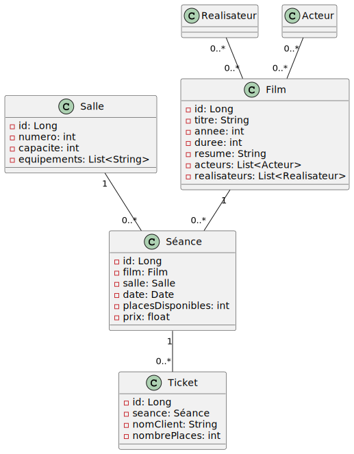

# Projet Cinema

## Présentation

Le but de ce projet est de créer une API REST en spring boot pour la gestion d'un cinéma.

## Sujets

__Objectif__ : Créer une API qui permet de gérer les films, les séances, les salles, les tickets, les acteurs et les réalisateurs d'un cinéma.

#### Fonctionnalités de base:

- Ajouter, modifier, supprimer et afficher les `films`
- Ajouter, modifier, supprimer et afficher les `séances`
- Ajouter, modifier, supprimer et afficher les `salles`
- Ajouter, modifier, supprimer et afficher les `tickets`
- Ajouter, modifier, supprimer et afficher les `acteurs`
- Ajouter, modifier, supprimer et afficher les `réalisateurs`

#### Fonctionnalités avancées:

- Associer des `acteurs` et des `réalisateurs` à des `films`
- Réserver des `tickets` pour une séance donnée
- Afficher la liste des `films` disponibles à une date donnée
- Afficher la liste des `salles` disponibles à une date et à une heure données
- Afficher la liste des `tickets` réservés pour une séance donnée

Pour réaliser cet exercice, vous devrez utiliser Spring Boot Web pour créer une API REST qui expose les différentes fonctionnalités de gestion de données. Vous devrez également utiliser un SGBD (comme MySQL ou H2) pour stocker les données de l'application et utiliser JPA (Java Persistence API) pour effectuer les opérations de persistance. Vous devrez enfin utiliser Maven ou Gradle pour gérer les dépendances et le cycle de vie du projet.

## Prérequis

- Java 11
- Docker et Docker Compose

## Installation

Dans un terminal, exécuter la commande suivante:

```bash
docker-compose up -d
```

## Utilisation

TODO

## Diagramme de classes

